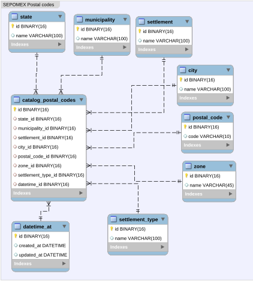

Mexican National Catalog of Postal Codes
======

The Mexican National Catalog of Postal Codes is prepared by the Mexican Postal Service (SEPOMEX)



This repository contains the database provided by sepomex in 2NF sql.

This database in sql format contains primary keys in uuid version 4, saved in binary format for mysql. The tables it contains are the following: states, municipalities, postal codes, settlement, type of settlement, zone and join table. 

each entity or state is separated by folders, these folders contain the sql files for execution. The order to loader doesn't matter if the file named postalCodeJoin_ is executed at the end, since this is the join table


## Install

### First
The `model.sql` has a sql model to loader in your database schema. 

you need load the `zone.sql` and `settlement_type.sql` 

### Second
select the state file that you want to load, execute all sql files and execute to the end the file that have named: `postCodeJoin_< state >.sql`

If you want to save the way you query the data in this database, you can make a view as below and have the data processed in a read-only view (ideal for DDD):

```sql
CREATE VIEW _postal_codes_view_view AS
SELECT 
state.name,
    municipality.name,
    settlement.name,
    city.name,
    postal_code.code
    FROM
    catalog_postal_codes
    INNER JOIN
    state ON state.id = catalog_postal_codes.state_id
    INNER JOIN
    municipality ON municipality.id = catalog_postal_codes.municipality_id
    INNER JOIN
    settlement ON settlement.id = catalog_postal_codes.settlement_id
    INNER JOIN
    city ON city.id = catalog_postal_codes.city_id
    INNER JOIN
    postal_code ON postal_code.id = catalog_postal_codes.postal_code_id
```


If you want to support me, you can [invite me a coffee]

[invite me a  coffee]:<https://www.buymeacoffee.com/uetiko>
